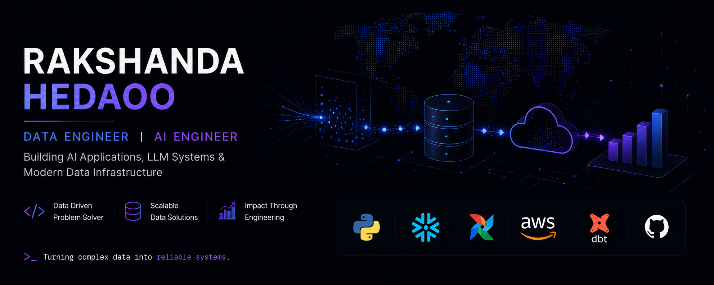

  

# Rakshanda Hedaoo

### Data Engineer • AI Engineer

Building AI Applications, LLM Systems & Modern Data Infrastructure

---

<h2>📊 GitHub Stats</h2>

  
  

---

## 🚀 About Me

- 💼 Data Engineer with experience in Snowflake, Airflow, dbt, AWS, and IICS
- 🤖 Exploring AI Engineering, LLM Applications, and RAG systems
- 🏗️ Passionate about building scalable data platforms and automation workflows
- 🚀 Currently building AI-powered applications and modern data infrastructure

---

## 🛠️ Tech Stack

### Languages & Databases

### Data Engineering

### Cloud & DevOps

### AI & ML

---

<h2>📌 Featured Projects</h2>

---

## 🎯 Current Focus

- AI Engineering
- Retrieval-Augmented Generation (RAG)
- LLM Applications
- Data Infrastructure
- Production Data Pipelines

---

## 🤝 Connect With Me

LinkedIn:
www.linkedin.com/in/rakshanda-hedaoo-94971b185
